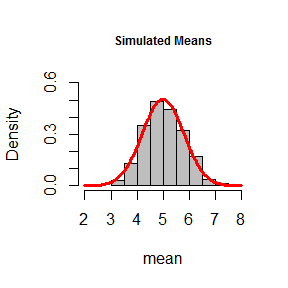
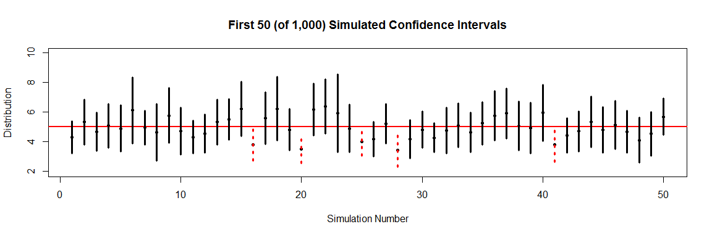

**Simulation with the Exponential Distribution**  
**Statistical Inference, Coursera**  
**Class Project #1, August 2014**  

This project is meant to simulate and investigate the exponential distribution function.  This simulation will show how the distribution of averages of 40 exponentials with a rate of lambda = 0.2 compares to the theoretical mean and variance of the distribution of the same rate. 

The seed is set using **set.seed** so that the simulation can be reproduced. Forty exponentials with rate 0.2 are randomly produced and placed in a row of a matrix.  This process is repeated 1,000 times.  

```r
set.seed(258)
nosim <- 1000; n <- 40; lambda <- 0.2 
my.matrix <- matrix(rexp(nosim*n, lambda), nosim) # a matrix of 40,000 randomly generated exponentials (1,000 rows * 40 columns)
```

Next, the mean and variance are calculated for each row of 40 random exponentials.  This returns 1,000 means and 1,000 variances.  The overall mean and the mean variance are calculated for those 1,000 simulations.  

```r
my.means <- apply(my.matrix, 1, mean)
my.var <- apply(my.matrix, 1, var)
mean.mean <- mean(my.means); mean.var <- mean(my.var)
```

**1. Show where the distribution is centered at and compare it to the theoretical center of the distribution.**  
The mean of the simulations is centered at 5.026.  The theoretical mean of the exponential distrubition is $\frac{1}{\lambda}$, and in this case where $\lambda = 0.2$ the theoretical mean is $\frac{1}{.2} =  5$.  The difference between the simulated mean and the theoretical mean is 0.026.  

**2. Show how variable it is and compare it to the theoretical variance of the distribution.**   
The mean variance of the simulations is 25.0643.  The theoretical variance of the exponential distriubtion is $\frac{1}{\lambda ^2}$, and in this case where $\lambda = 0.2$ the theoretical variance is $\frac{1}{.2^2} = \frac{1}{0.04} = 25$.  The difference between the simulated variance and the theorectical variance is 0.0643.

**3. Show that the distribution is approximately normal.**  
This density plot demonstrates the approximate normal distribution of the mean. The normal distribution with mean = 5 and sd = 1 is overlaid to compare the simulation distribution to the expected exponential distribution.  The distribution of the sample means is approximately normal.  

```r
hist(my.means, prob = TRUE, main = "Simulated Means"
     , xlab = "mean")
curve(dnorm(x, mean=5, sd=1), add=TRUE, col="red", lwd=5)
```

 

**4. Evaluate the coverage of the 95% confidence interval for 1/lambda.**  
The 95% confidence interval for $\frac{1}{\lambda}: \bar{X} \pm 1.96*\frac{s}{\sqrt{n}}$.  The lower bound and the upper bound for the confidence interval for each of the 1,000 simulations is calcuated. 

```r
for (i in 1:length(my.means)) {
  ll <- my.means - (1.96 * sqrt(my.var)/sqrt(n))
  ul <- my.means + (1.96 * sqrt(my.var)/sqrt(n))
}
coverage <- table(1/lambda > ll & 1/lambda < ul)
```

Of the 1,000 simulations, 940 of the confidence intervals contain the theoretical mean of 0.2. This is a 94% rate.  This graph shows the first 50 (of 1,000) simulations.  The theoretical mean is represented by the red horizontal line at y = 5.  Solid black vertical lines show sample cases where the confidence interval contains the theoretical mean. Dashed red vertical lines show sample chases where the confidence interval does not contain the theoretical mean.

```r
plot(my.means[1:50], ylim=c(min(ll),max(ul)), xlab = "Simulation Number", ylab= "Distribution", pch = 20, main = "First 50 (of 1,000) Simulated Confidence Intervals")
abline(a = 5, b = 0, lty = 1, lwd = 2, col = "red")
c <- ll[1:50] > 5 | ul[1:50] < 5
segments(1:50, ll[1:50], 1:50, ul[1:50], col=c(par('fg'),'red')[c+1], lty = c(1,3)[c+1], lwd=3)
```

 
