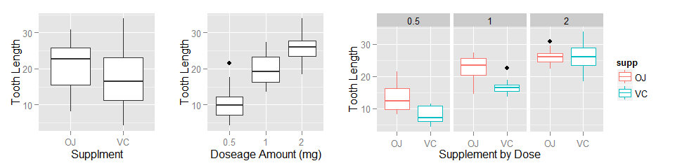

**Simulation with the Exponential Distribution**  
**Statistical Inference, Coursera**  
**Class Project #2, August 2014**  

Using the [ToothGrowth][1] dataset, this paper explores tooth growth for six sets of ten guinea pigs.  The six sets are differentiated by the type of supplement received (orange juice (OJ) or ascorbic acid (VC)) and the dose in milligrams received (0.5, 1, or 2) of the supplement.  


```r
# load data, change dose to factor with 3 levels
tg <- ToothGrowth
tg$dose <- as.factor(tg$dose) # convert dose to factor
```

The measurements of central tendancy (mean and standard devation) of tooth growth is calcuatled by supplement (supp), dosage (dose), and supp-dose pairs.  The code is shown for the dose-supp pair, and the other code is hidden in order to save space. 

```r
plyr::ddply(tg, .(dose, supp), summarize,
      mean = round(mean(len),2), sd = round(sd(len),2))
```

<table class='container'><tr><td><table>
 <thead>
  <tr>
   <th align="left"> supp </th>
   <th align="right"> mean </th>
   <th align="right"> sd </th>
  </tr>
 </thead>
<tbody>
  <tr>
   <td align="left"> OJ </td>
   <td align="right"> 20.66 </td>
   <td align="right"> 6.61 </td>
  </tr>
  <tr>
   <td align="left"> VC </td>
   <td align="right"> 16.96 </td>
   <td align="right"> 8.27 </td>
  </tr>
</tbody>
</table>
</td><td><table>
 <thead>
  <tr>
   <th align="left"> dose </th>
   <th align="right"> mean </th>
   <th align="right"> sd </th>
  </tr>
 </thead>
<tbody>
  <tr>
   <td align="left"> 0.5 </td>
   <td align="right"> 10.61 </td>
   <td align="right"> 4.50 </td>
  </tr>
  <tr>
   <td align="left"> 1 </td>
   <td align="right"> 19.73 </td>
   <td align="right"> 4.42 </td>
  </tr>
  <tr>
   <td align="left"> 2 </td>
   <td align="right"> 26.10 </td>
   <td align="right"> 3.77 </td>
  </tr>
</tbody>
</table>
</td><td><table>
 <thead>
  <tr>
   <th align="left"> dose </th>
   <th align="left"> supp </th>
   <th align="right"> mean </th>
   <th align="right"> sd </th>
  </tr>
 </thead>
<tbody>
  <tr>
   <td align="left"> 0.5 </td>
   <td align="left"> OJ </td>
   <td align="right"> 13.23 </td>
   <td align="right"> 4.46 </td>
  </tr>
  <tr>
   <td align="left"> 0.5 </td>
   <td align="left"> VC </td>
   <td align="right"> 7.98 </td>
   <td align="right"> 2.75 </td>
  </tr>
  <tr>
   <td align="left"> 1 </td>
   <td align="left"> OJ </td>
   <td align="right"> 22.70 </td>
   <td align="right"> 3.91 </td>
  </tr>
  <tr>
   <td align="left"> 1 </td>
   <td align="left"> VC </td>
   <td align="right"> 16.77 </td>
   <td align="right"> 2.52 </td>
  </tr>
  <tr>
   <td align="left"> 2 </td>
   <td align="left"> OJ </td>
   <td align="right"> 26.06 </td>
   <td align="right"> 2.66 </td>
  </tr>
  <tr>
   <td align="left"> 2 </td>
   <td align="left"> VC </td>
   <td align="right"> 26.14 </td>
   <td align="right"> 4.80 </td>
  </tr>
</tbody>
</table>
</td></tr></table>

These boxplots present a visual representation of the spread of data suggesting
- Orange juice (OJ) promotes longer tooth growth than ascorbic acid (VC) overall.  
- Increased doseage amounts of either supplement promotes longer tooth growth.  
- Orange juice promotes longer tooth growth for doses at 0.5 and 1.0 mg.  
- Orange juice and ascorbic acid have similar effects on tooth growth at doses of 2.0 mg.  

However, independent samples t-tests on these three categories (dose only, supplement along, dose-supplement pair) will be run to determine if these differences are significant or if the difference is simply what would be expected to due chance.  If the differences are significant, then the findings can be applied to the general population of gineau pigs.  

 

For the **supp** t-test, the data is subsetted into 30 cases each of OJ or VC.  
For the **dose** t-tests, the data is subsetted into 20 cases each of 0.5, 1.0, and 2.0 mg.  
For the **dose-supp** t-tests, data is subsetted into 10 cases each of the six possible combinations (0.5OJ, 0.5VC, 1.0OJ, 1.0VC, 2.0OJ, 2.0VC).  
Here is code for one of the subsets.  All other code is suppressed to save space.


```r
# oj vs. vc
supp.oj <- tg$len[tg$supp == "OJ"]; supp.vc <- tg$len[tg$supp == "VC"]
```


For each t-test, the null hypothesis is that the mean tooth length for each group pairing is equal.  Using the supplement pair as an example, the null hypothesis is $H_0$: mean tooth length of OJ = mean tooth length of VC and $H_A$: the means are not equal.  $H_0$ is rejected at the 95% confidence interval when the p-value < 0.05 and the confidence interval range does not include zero as a value.  

Prior to running the independent t-test, the assumption of homogeneity of variance was testing using Levene's Test.  Since the p-value for Levene's Test was greater than 0.05, the independent t-test can proceed assuming equal variances among groups (i.e. var.equal = TRUE).  The code for Levene's Test follows this example.


```r
car::leveneTest(len ~ supp, data = tg)
```


Again, using the supplement pair as an example, each two sample indepent groups t-test is calculated following this code structure.  


```r
ttest.oj.vc <- t.test(supp.oj, supp.vc, paired = FALSE, var.equal = TRUE)
```

This table summarizes the results of the seven t-tests.  Five of the seven tests returned significant p-values.  

|Category    |Pairing                                     | CI.Low| CI.Upper|      t| p-val| df|CI.Includes.Zero |
|:-----------|:-------------------------------------------|------:|--------:|------:|-----:|--:|:----------------|
|Supplement  |supp.oj and supp.vc                         |  -0.17|     7.57|   1.92| 0.060| 58| TRUE            |
|Doseage     |dose.0.5mg and dose.1mg                     | -11.98|    -6.28|  -6.48| 0.000| 38|FALSE            |
|Doseage     |dose.0.5mg and dose.2mg                     | -18.15|   -12.84| -11.80| 0.000| 38|FALSE            |
|Doseage     |dose.1mg and dose.2mg                       |  -8.99|    -3.74|  -4.90| 0.000| 38|FALSE            |
|Dose + Supp |d.0.5mg.and.supp.oj and d.0.5mg.and.supp.vc |   1.77|     8.73|   3.17| 0.005| 18|FALSE            |
|Dose + Supp |d.1mg.and.supp.oj and d.1mg.and.supp.vc     |   2.84|     9.02|   4.03| 0.001| 18|FALSE            |
|Dose + Supp |d.2mg.and.supp.oj and d.2mg.and.supp.vc     |  -3.72|     3.56|  -0.05| 0.964| 18| TRUE            |

#### Summary of Findings  
- There is no overall difference in tooth growth for supplement type (orange juice vs. ascorbic acid)  
- There is signficant difference in tooth growth in all comparisons of doseage amounts, regardless of the supplmement type.  Tooth growth increases with an increase in doseage amount.  
- There is signficant difference in tooth growth between supplement type dosed at either 0.5 mg or 1.0 mg.  Orange juice results in longer tooth growth than ascorbic acid at these doses.  
- Tooth growth is expected to be similar when either supplement is dosed at 2.0 mg.

#### Detailed Fidings  

**Findings for Supplement Comparison**  
These data do not provide evidence that there is a signficant difference in the tooth growth in gineau pigs receiving orange juice (mean = 20.66, sd = 6.61) from those receiving ascorbic acid (mean = 16.96, sd = 8.27), t(58) = 1.92, p  = 0.06.  Even though one might surmise from the boxplot that there is a noticable difference in these two supplements, this difference can be accounted for what would occur by chance.  

**Findings for Doseage Comparison**  
**0.5 mg vs. 1.0 mg**: These data provide convincing evidence that tooth growth in gineau pigs receiving 0.5 mg of supplement (mean = 10.61, sd = 4.5) is shorter than gineau pigs receiving 1.0 mg of supplement (mean = 19.73, sd = 4.42), t(38) = -6.48, p <  0.005.  The data suggests with 95% confidence that the tooth growth in gineau pigs receiving 0.5 mg of supplement will be between 6.28 and 11.98 units shorter than gineau pigs receiving 1.0 mg of supplement.

**0.5 mg vs. 2.0 mg**: These data provide convincing evidence that tooth growth in gineau pigs receiving 0.5 mg of supplement (mean = 10.61, sd = 4.5) is shorter than gineau pigs receiving 2.0 mg of supplement (mean = 26.1, sd = 3.77), t(38) = -11.8,  p <  0.005.  The data suggests with 95% confidence that the tooth growth in gineau pigs receiving 0.5 mg of supplement will be between 12.84 and 18.15 units shorter than gineau pigs receiving 2.0 mg of supplement.

**1.0 mg vs. 2.0 mg**: These data provide convincing evidence that tooth growth in gineau pigs receiving 1.0 mg of supplement (mean = 19.73, sd = 4.42) is shorter than gineau pigs receiving 2.0 mg of supplement (mean = 26.1, sd = 3.77), t(38) = -4.9, p <  0.005.  The data suggests with 95% confidence that the tooth growth in gineau pigs receiving 1.0 mg of supplement will be between 3.74 and 8.99 units shorter than gineau pigs receiving 2.0 mg of supplement.  

**Finding for Doseage/Supplement Pairs**  
**OJ vs. VC, at 0.5 mg**: These data provide convincing evidence that tooth growth in gineau pigs receiving 0.5 mg of orange juice (mean = 13.23, sd = 4.46) is longer than gineau pigs receiving 0.5 mg of ascorbic acid (mean = 7.98, sd = 2.75), t(18) = 3.17, p = 0.005.  The data suggests with 95% confidence that the tooth growth in gineau pigs receiving 0.5 mg of orange juice will be between 1.77 and 8.73 units longer than gineau pigs receiving 0.5 mg of ascorbic acid.  

**OJ vs. VC, at 1.0 mg**: These data provide convincing evidence that tooth growth in gineau pigs receiving 1.0 mg of orange juice (mean = 22.7, sd = 3.91) is longer than gineau pigs receiving 1.0 mg of ascorbic acid (mean = 16.77, sd = 2.52), t(18) = 4.03, p < 0.005.  The data suggests with 95% confidence that the tooth growth in gineau pigs receiving 1.0 mg of orange juice will be between 2.84 and 9.02 units longer than gineau pigs receiving 1.0 mg of ascorbic acid.  

**OJ vs. VC, at 2.0 mg**: These data do not provide evidence that there is a signficant difference in the tooth growth in gineau pigs receiving 2.0 mg of orange juice (mean = 26.06, sd = 2.66) is longer than gineau pigs receiving 2.0 mg of ascorbic acid (mean = 26.14, sd = 4.8), t(18) = -0.05, p = 0.964.

#### Session Info  

```
## R version 3.1.0 (2014-04-10)
## Platform: x86_64-w64-mingw32/x64 (64-bit)
## 
## locale:
## [1] LC_COLLATE=English_United States.1252 
## [2] LC_CTYPE=English_United States.1252   
## [3] LC_MONETARY=English_United States.1252
## [4] LC_NUMERIC=C                          
## [5] LC_TIME=English_United States.1252    
## 
## attached base packages:
## [1] grid      stats     graphics  grDevices utils     datasets  methods  
## [8] base     
## 
## other attached packages:
## [1] car_2.0-21      knitr_1.6       gridExtra_0.9.1 plyr_1.8.1     
## [5] ggplot2_0.9.3.1
## 
## loaded via a namespace (and not attached):
##  [1] colorspace_1.2-4 digest_0.6.4     evaluate_0.5.5   formatR_0.10    
##  [5] gtable_0.1.2     htmltools_0.2.4  labeling_0.2     MASS_7.3-31     
##  [9] munsell_0.4.2    nnet_7.3-8       proto_0.3-10     Rcpp_0.11.1     
## [13] reshape2_1.4     rmarkdown_0.2.64 scales_0.2.4     stringr_0.6.2   
## [17] tools_3.1.0      yaml_2.1.11
```

[1]: http://stat.ethz.ch/R-manual/R-devel/library/datasets/html/ToothGrowth.html
